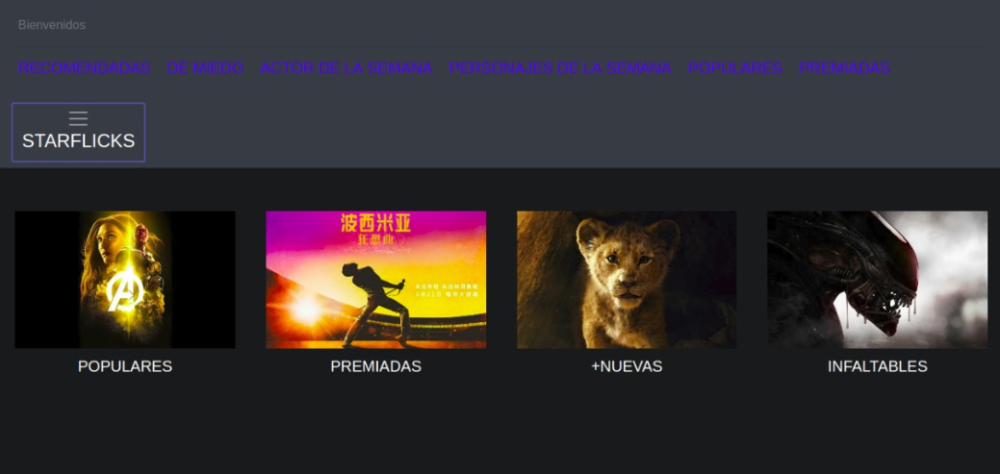
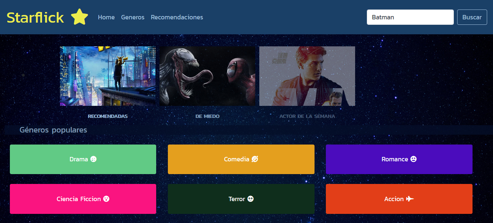
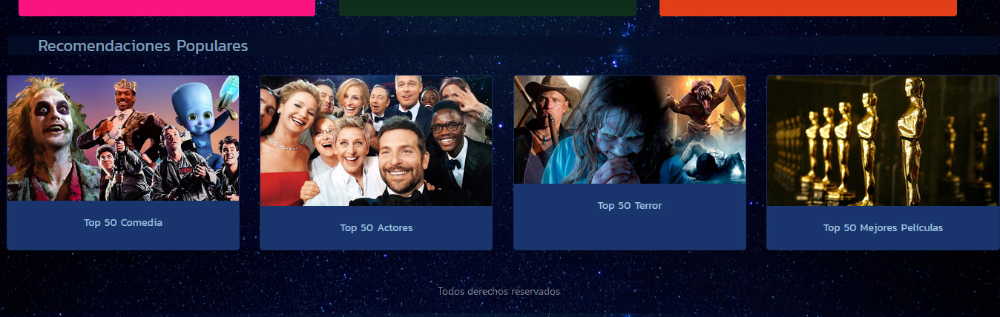
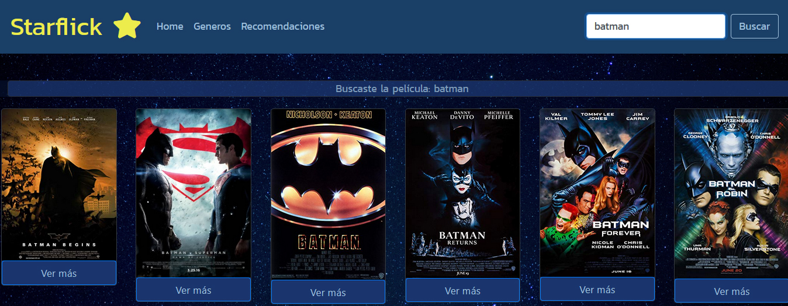

## **STARFLICK**

# *"Hackathon" de final de Common Core, películas*
-------------------------------------------

## **Índice** 
---
* [A-Contexto](#A-Contexto)
* [B-Resumen del proyecto](#B-resumen-del-proyecto)
* [1-Planificación](#1-Planificación)
* [2-Investigación: Radiografía Gamers](#2-Investigación:-Radiografía-Gamers)

* [3-¿Cómo son los Gamers Chilenos?](#3-¿Cómo-son-los-Gamers-Chilenos?)

* [4-Recolección de Datos](#4-Recolección-de-Datos)
* [5-Proceso de Diseño](#5-Proceso-de-Diseño)
* [6-PRODUCTO](#6-PRODUCTO)

***

## **A-Contexto**
***
Una cantidad abrumadora de películas... ha cambiado la experiencia del usuario y modificado el mercado de las películas a nivel global.

Originalmente, las bases de datos del sector audiovisual parecían responder a las necesidades de una audiencia formada por estudiosos vinculados con la academia, profesionales del sector (p.e. productores) y lo que siempre se ha denominado cinéfilos, es decir, grandes aficionados al cine y la televisión, tuvieran o no vinculaciones académicas o profesionales con el audiovisual.

No obstante, el enorme crecimiento experimentado en los últimos años en el consumo del llamado Video on Demand (VoD) en forma de portales de cine y de series de televisión, como Wuaki, Netflix, Filmin o Hulu, o de portales de las propias productoras, como HBO, ha generado una nueva demanda de estas bases de datos: las legiones de espectadores que reclaman información sobre sus películas y series favoritas.

***

## **B-Resumen del proyecto**
***
En la Novena generación de Laboratoria SCL, se nos planteó el desafió de hacer  una página web para visualizar un conjunto de datos con Temática de Peliculas que se adecúe a lo que el usuario necesita. Para esta ardua tarea comenzamos, planteando las siguientes etapas:

---
---

## **1-Planificación**
- Aplicación de [Trello](https://trello.com/b/gtbz9bRh/peliss)
---
 

- Esquemas, Flujos

---

## **2-Investigación: Radiografía Cinéfilos🤓**

***

Comenzamos con una búsqueda online para conocer las aplicaciones disponibles que den información similar a la nuestra, e investigamos 3 sitios reconocidos que proporcionan o presentan la información con una data relacionada a las peliculas en general. 

- [IMDb](https://www.imdb.com/) (En inglés, una de las páginas veteranas sobre el tema de películas y fuente principal de otras.)
- [AllMovie](https://www.allmovie.com/)(En inglés, enfocada más a las tendencias actuales. )
- [The Movie DB](https://www.themoviedb.org/?language=es-ES)(En español, con la interfaz mas moderna y minimalista.)

Referencias de Investigación: 

 
 [COMPARACION ENTRE WEBS](
https://www.lluiscodina.com/bases-de-datos-de-cine-y-television/)

---
---

## **3-Algunos datos 🤓** 

***
SABÍAS QUE...

" EL CINE ES LA MANIFESTACIÓNCULTURAL MÁS POPULAR Y MASIVA ENTRE LAS Y LOS CHILENOS, Y QUE QUIENES MÁS ASISTEN SON JÓVENES DE ENTRE 15 Y 29
AÑOS".

Referencias de Investigación: [Encuesta Nacional de Participación Cultural 2017](http://los40.cl/los40/2017/05/31/actualidad/1496249056_171242.html)

---
---

## **4-Recolección de Datos**

***

**Consideraciones:**
- ¿Quién es el usuario? 
- ¿Cuáles son los objetivos del usuario en relación con la appWeb?
- ¿Cuáles son los datos relevantes que quiere ver el usuario y por qué?
- ¿Cuándo utilizaría la appWeb?

---

**Entrevista Tipo: Usuario testeado:**

Se realizaron entrevistas con las siguientes preguntas:

**-Datos usuario;**

 Edad: 

 hombre/mujer:

**-¿que tanto te gusta ver peliculas?**

**-¿con que frecuencia ves peliculas?**

**-¿que tipo de peliculas prefieres y porque?**

**-¿Qué información te ayudaria para elegir que pelicula ver dentro de tu preferencia?**

**-¿Cuándo o en qué situación usarían la app?**

**Observaciones y otros:**

---

## **5-Proceso de Diseño**
***

**Definición del usuario:**
---

- Cinéfilos, amantes del cine, seguidores de peliculas, actores de cine y personajes del cine.
- Hombres y mujeres de 15 a 30 años.
- Que utilizarían la app. para elegir entre la abrumadora cantidad de peliculas.
- Con el objetivo de obtener información sobre que película es la mejor opcion según los criterios del usuario.

---
**Definición de la Problemática:** &#128559;
---
---

**" La cantidad abrumadora de películas ha cambiado la experiencia del usuario, por lo que es cada vez más complicado tomar una eleccion a corto tiempo para elegir que ver"**

Sobre lo investigado;

Se necesita una aplicacion web para quienes disfrutan de las películas y dan importancia al tiempo que invierten en la elecion de estas.

Es importante dar la posibilidad de ver peliculas por genero, por Actores, etc.  y asi dar recomendaciones como por ejemplo del mismo actor y otros.

**ENTREVISTAS**

Se realizaron entrevistas a potenciales usuarios, puedes escuchar una de ellas en el siguiente enlace: https://soundcloud.com/gaba-gonzalez-1/user  
También puedes observar uno de nuestros videos de usuarios usando nuestra webapp.

**Conclusiones**
---

Durante la entrevista con el usuario se destacan:

-La mucha informacion que posee el usuario hoy en día, dificultando una buena seleccion, por lo que se hace importante, para necesidad de nuestro usuario:

•	Si pudiese visualizar la información concisa de nombres e imágenes.

•	Si pudiese ver recomendacion por género o actores, lo que es realmente relevante entre tanta información.

•   Y quizás, de manera secundaria, información extra como reseña, calicacion, colores, tipografica, etc. La importancia de visual desing...

---
**HISTORIAS DE USUARIOS**
---
***
1.	Yo como usuario quiero poder ver las películas por género.

2.	Yo como usuario quiero poder ver recomendaciones de películas.

3.	Yo como usuario quiero poder ver información detallada de la película que seeccione.

4.	Yo como usuario quiero poder buscar películas por su nombre.

---
### IDEACIÓN Y PROTOTIPADO
***

**AVANCES**

#### Prototipo de baja fidelidad

- Prototipado (sketching)

---

#### Prototipo de alta fidelidad

 Test Usabilidad Diseño de experiencia de usuario (UX):

 - Prototipado

   Puedes ver nuestro prototipo Figma [Aquí](https://www.figma.com/file/UWX7QH4jsgJlrdHrWYHBFBvW/StarFlick?node-id=0%3A1)

***
 - Testeo e Iteración

   En estos testeos podemos conseguir información para corregir diseño, modificar colores, formas, etc.
   Se decide por la familiaridad que tiene el usuario con aplicaciones de visualizacion de contenido (netflix, hulu,  seguir patrones similares de colores, estilos, etc.
   Se corrigen ubicaciones de la información.

   Y se consideran para futuros cambios (hacking edition); opciones adicionales si fueran necesarios para hacer mas amigable la aplicación para el usuario.

Los primeros testeos se realizaron con el siguiente diseño:

Puedes verlo en video ingresando [Aquí](https://youtu.be/8a-L6i_U65k)

***
- Iteración

Posterior las primeras entrevistas, pudimos concluir el recorrido que hace el usuario al usar la aplicación. 
Esto nos confirma el orden de las Historias de Usuarios para poder dejarlos de la siguientes manera:

1. Mostrar películas por nombre o género 
2. Entregar, luego de la búsqueda, información más detalla de ellas.
3. Dar recomendaciones de películas.

Posteriormente, luego de las revisiones, se llegó a la iteración final 

---
---
## **6-STARFLICK**
---
***

**QUÉ ES? 😯**
--
Aplicación web para cinefilos e interesados en las peliculas, que entrega recomendaciones para elegir peliculas en diferentes momentos.

**Su funcionalidad**
---
" El objetivo de la plataforma es ser una herramientas que ayude en el proceso de busqueda de información y elección .."

**La interfaz permite al usuario:**
--
- Ver peliculas por nombre.
- Ver peliculas por género.
- Ver recomendaciones de peliculas por actores u otros.
- Ver información mas detallada de las películas seleccionadas.

**Links relacionados**
--
- Github
- Github pages

